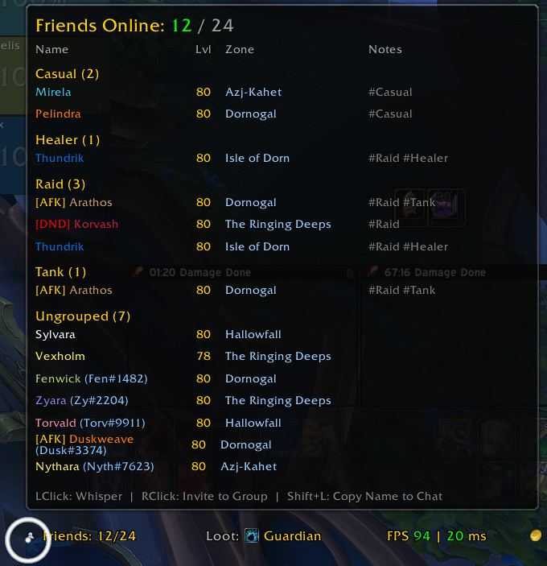
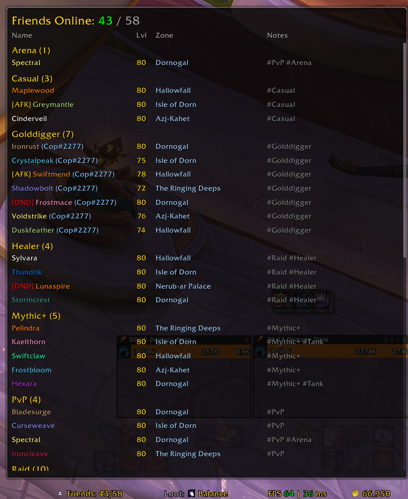
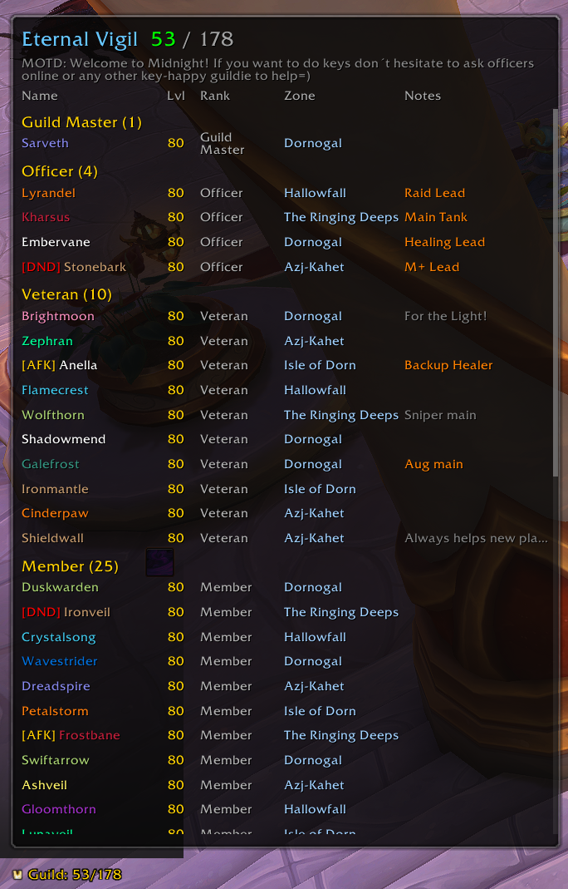

# Djinni's Guild & Friends

LDB data brokers for your **Friends List**, **Guild Roster**, and **Communities** with interactive clickable tooltips. Works with any LDB display: ElvUI DataText, TitanPanel, EQOL Datapanels, FuBar, and more.

Loosely inspired by the ElvUI Shadow & Light friends list.

---

## Screenshots

**Friends List — grouped by note tags**



**Friends List**



**Guild Roster**



---

## Features

- **Three LDB brokers** — Friends, Guild, and Communities, each as an independent data source
- **Clickable tooltips** — custom frames with per-member rows; click to whisper, invite, /who, and more
- **Scrollable tooltips** — configurable max height per broker; mouse wheel to scroll with visual scrollbar indicator
- **Configurable click actions** — remap Left, Right, Shift+Left, Shift+Right, and Middle click independently per broker
- **Hint bar** — tooltip footer shows all configured click actions at a glance; can be toggled off per broker
- **Grouping** — group friends by BNet/In-Game, zone, or `#tag` notes; guild members by rank, level bracket, or zone
- **Sorting** — sort by name, class, level, zone, or status; ascending or descending
- **Class-coloured names** — member names tinted by their class colour
- **AFK / DND indicators** — visual status markers on each row
- **Battle.net friends** — shows BNet friends currently playing WoW alongside character friends
- **Guild officer notes** — optionally display officer notes inline in the guild tooltip (requires guild rank permission)
- **Communities** — dynamically lists all your subscribed communities (skipping guild, which has its own broker); individual communities can be hidden from settings
- **Numeric inputs on sliders** — click the value next to any slider to type an exact number
- **Copy settings** — copy display settings (scale, width, row spacing, max height) between brokers
- **Blizzard Settings integration** — all options accessible via Game Menu → Options → AddOns → Djinni's Guild & Friends
- **No external dependencies** — all required libraries are embedded; no Ace3 or other frameworks needed

---

## Panel Text Tokens

Each broker's label text is fully configurable using these tokens:

| Token | Replaced With |
|-------|---------------|
| `<online>` | Online member count |
| `<total>` | Total member count |
| `<offline>` | Offline member count |
| `<guildname>` | Guild name *(Guild broker only)* |

**Examples**
- `Friends: <online>/<total>` → `Friends: 12/24`
- `<guildname>: <online> online` → `Eternal Vigil: 14 online`
- `Communities: <online>` → `Communities: 10`

---

## Click Actions

All click actions are configurable per broker. Available actions:

| Action | Description |
|--------|-------------|
| Whisper | Open a whisper window to the member |
| Invite to Group | Invite the member to your current group |
| /who Lookup | Perform a `/who` search for the member |
| Copy Name to Chat | Copy the member's name into the active chat box |
| Open Friends List | Open the Blizzard Friends panel |
| Open Guild Roster | Open the Blizzard Guild panel |
| Open Communities | Open the Blizzard Communities panel |
| None | No action |

---

## Grouping

### Friends
| Mode | Description |
|------|-------------|
| No Grouping | Flat sorted list |
| BNet / In-Game | Separates Battle.net friends from WoW character friends |
| Same Zone | Groups friends sharing the same zone |
| Friend Note (#tags) | Groups by `#TagName` entries in friend notes (FriendGroups-compatible) |

### Guild
| Mode | Description |
|------|-------------|
| No Grouping | Flat sorted list |
| Guild Rank | Groups by rank name |
| Level Bracket | Groups: 80, 70–79, 60–69, <60 |
| Same Zone | Groups members sharing the same zone |

---

## Slash Commands

```
/dgf          — Open settings panel
/dgf options  — Open settings panel
/dgf demo     — Toggle demo mode (fake data for screenshots)
```

---

## Dependencies

All libraries are **embedded** — no separate addon installs required:

- LibStub
- CallbackHandler-1.0
- LibDataBroker-1.1

**Optional**: An LDB display addon to show the broker panels (ElvUI, TitanPanel, EQOL Datapanels, FuBar, etc.)

---

## File Structure

```
DjinnisGuildFriends/
├── DjinnisGuildFriends.toc      -- Addon metadata and load order
├── Core.lua                     -- Namespace, saved variables, shared utilities
├── FriendsBroker.lua            -- Friends LDB broker and tooltip
├── GuildBroker.lua              -- Guild LDB broker and tooltip
├── CommunitiesBroker.lua        -- Communities LDB broker and tooltip
├── Settings.lua                 -- Blizzard Settings UI
├── DemoMode.lua                 -- Optional: fake data for screenshots (see TOC)
├── README.md
├── Docs/                        -- Screenshots
└── Libs/
    ├── LibStub/
    ├── CallbackHandler-1.0/
    └── LibDataBroker-1.1/
```

---

## WoW APIs Used

### Friends
- `C_FriendList.GetFriendInfoByIndex()`, `GetNumFriends()`, `GetNumOnlineFriends()`
- `C_BattleNet.GetFriendAccountInfo()`, `GetFriendNumGameAccounts()`, `GetFriendGameAccountInfo()`

### Guild
- `GetGuildRosterInfo()`, `GetNumGuildMembers()`, `GetGuildInfo()`

### Communities
- `C_Club.GetSubscribedClubs()`, `GetClubMembers()`, `GetMemberInfo()`
- `C_CreatureInfo.GetClassInfo()` — class token from classID

### Actions
- `ChatFrameUtil.SendTell()` / `ChatFrameUtil.SendBNetTell()`
- `C_PartyInfo.InviteUnit()` / `BNInviteFriend()`
- `C_FriendList.SendWho()`
